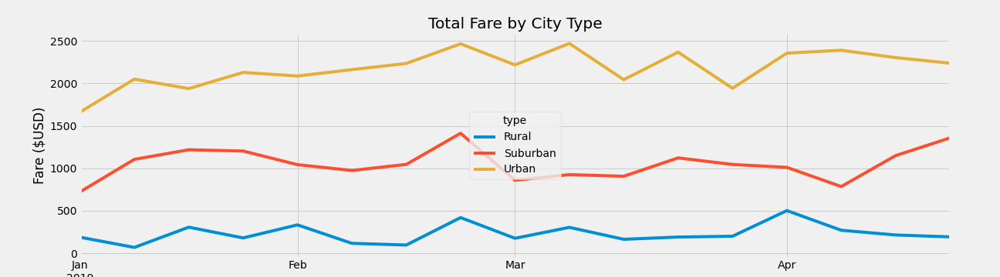

# PyBer_Analysis
Analyzing and visualizing ridesharing data with Python.

## Overview
The purpose of this project is to perform analysis of Pyber ride sharing data in order to gain an understanding of ridership and fare metrics by the types of cities in which Pyber operates and creating visualizations of rideshare data for PyBer. This will help improve access to ride-sharing services and determine affordability for underserved neighborhoods.

## Results

By reviewing the summary we can see that there are several key findings including:
* Urban cities has the highest ridership demand while rural cities has the lowest.
* Urban cities have 4 times more drivers than suburban cities.
* Suburban cities have 6 times the drivers than rural with almost 4.5x the revenue.
* Rural cities have the highest average fare per ride and driver.
* The summary data shows a relationship where fare revenue is higher by city type when there is a larger ratio of drivers to rides.

## Summary
Based on the analysis my business recommendations to Pyber are: Increasing the amount of drivers in Rural areas to ensure there are enough drivers to meet ride demand. Data for rural cities shows that the average fare per ride and average fare per driver is much higher than Suburban and urban cities.This can indicate that rural area based riders are taking trips over a longer distance. This can result in a majority of drivers being occupied with current trips and loss in potential revenue when there are peaks in business.
